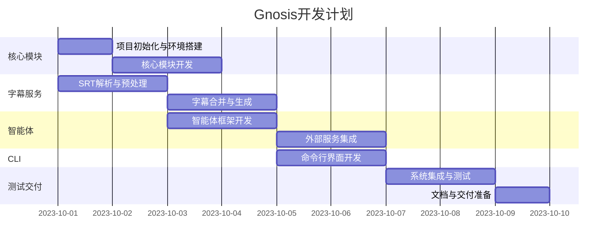

# Gnosis 项目开发任务拆分

## 总体时间规划
- **总开发时间**: 10个工作日
- **并行任务**: 核心模块开发与字幕服务可并行进行
- **关键里程碑**: 
  - 第3天: 完成字幕处理核心功能
  - 第6天: 完成智能体集成
  - 第10天: 完整系统交付

## 详细任务拆分

### 第1天: 项目初始化与环境搭建
- **任务1.1**: 创建项目目录结构
  - 实现完整的目录树结构
  - 初始化Git仓库
  - 设置Python虚拟环境
- **任务1.2**: 配置管理模块开发
  - 实现配置加载逻辑 (config.py)
  - 支持环境变量和配置文件
  - 完成基础配置项定义

### 第2天: 核心模块开发
- **任务2.1**: 日志系统实现 (logger.py)
  - 实现分级日志记录
  - 添加文件和控制台输出
  - 配置日志格式化

### 第3天: 字幕服务开发 (Part 1)
- **任务3.1**: SRT解析器实现
  - 开发SRT文件解析逻辑
  - 支持多种编码格式
  - 实现时间码验证
- **任务3.2**: 预处理功能开发
  - 实现空格去除功能
  - 开发空行清理逻辑
  - 添加基本格式验证

### 第4天: 字幕服务开发 (Part 2)
- **任务4.1**: 字幕合并引擎
  - 实现智能合并算法
  - 添加时间间隔阈值配置
  - 开发合并边界检测
- **任务4.2**: SRT生成器
  - 实现SRT格式化输出
  - 添加时间码精确保持
  - 开发异步文件写入

### 第5天: 翻译智能体开发
- **任务5.1**: 智能体框架搭建 (translator.py)
  - 实现Agno基础集成
  - 创建智能体初始化逻辑
  - 开发消息处理接口
- **任务5.2**: 核心翻译逻辑
  - 实现文本翻译流程
  - 添加语言对支持
  - 开发错误重试机制

### 第6天: 外部服务集成
- **任务6.1**: 智能体集成
  - 连接智能体与LLM网关
  - 实现API密钥管理
  - 添加速率限制控制

### 第7天: CLI开发
- **任务7.1**: 命令行界面基础 (cli.py)
  - 实现参数解析
  - 添加基本命令结构
  - 开发帮助系统
- **任务7.2**: 进度反馈系统
  - 集成tqdm进度条
  - 实现实时状态更新
  - 添加错误报告功能

### 第8天: 系统集成与测试
- **任务8.1**: 端到端流程集成
  - 连接所有模块
  - 实现完整处理流程
  - 开发模块间接口测试
- **任务8.2**: 单元测试开发
  - 字幕服务单元测试
  - 智能体功能测试
  - CLI参数验证测试

### 第9天: 性能优化与错误处理
- **任务9.1**: 性能优化
  - 实现异步批处理
  - 添加内存使用优化
  - 开发大文件分块策略
- **任务9.2**: 错误处理增强
  - 添加智能重试机制
  - 实现错误隔离
  - 开发用户友好错误报告

### 第10天: 文档与交付准备
- **任务10.1**: 用户文档编写
  - 安装指南
  - 使用手册
  - 配置说明
- **任务10.2**: 最终测试与打包
  - 全功能回归测试
  - 创建安装包
  - 准备交付文档

## 任务依赖关系

## 风险管理计划

1. **字幕合并算法复杂性**
   - 应对方案: 第3天完成基础版本，第9天预留优化时间
   
2. **LLM API稳定性风险**
   - 应对方案: 实现多服务商支持，添加健壮的错误处理
   
3. **大文件处理性能问题**
   - 应对方案: 第9天专门进行性能优化，实现分块处理

4. **进度延误风险**
   - 应对方案: 关键模块并行开发，每日代码审查
