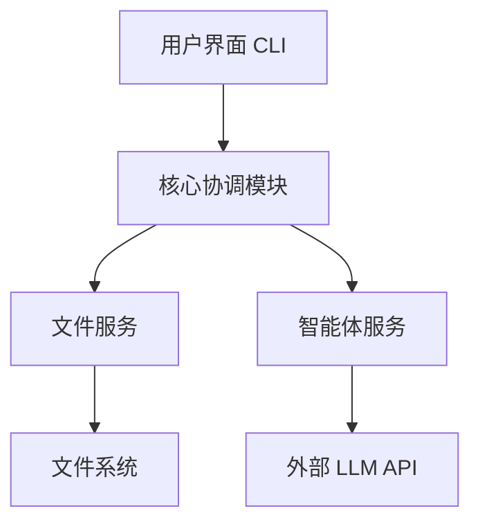

# Gnosis 项目架构设计

## 简介

Gnosis 是一个基于智能体的文本处理系统，专注于使用 AI 技术进行文本翻译。本文档描述了 Gnosis 的整体架构设计，包括核心组件、数据流和技术选择。

## 系统概览

Gnosis 采用简洁的架构设计，将文件处理与智能体处理分离，让智能体承担主要的文本处理工作。

## 核心组件

### 1. 用户界面 (CLI)

命令行界面允许用户指定输入文件、输出位置、源语言和目标语言等参数。CLI 负责参数解析、验证和进度显示。

**关键文件**: `cli.py`

### 2. 核心协调模块

负责协调整个处理流程，包括配置管理、日志记录和异常处理。

**关键文件**: 
- `gnosis/core/config.py` - 配置管理
- `gnosis/core/logger.py` - 日志记录

### 3. 文件服务

提供基本的文件读写功能，支持异步操作和错误处理。

**关键文件**: `gnosis/services/subtitle.py`

### 4. 智能体服务

基于 Agno 框架实现的智能体，负责文本翻译和处理。

**关键文件**: `gnosis/agents/translator.py`

### 5. 外部服务集成

与外部 LLM API (如 OpenAI, Google Gemini) 的集成。

## 数据流

1. 用户通过 CLI 提供输入文件路径和参数
2. 核心协调模块初始化处理流程
3. 文件服务读取输入文件内容
4. 内容传递给智能体服务进行处理
5. 智能体调用外部 LLM API 进行翻译
6. 处理后的内容由文件服务写入输出文件
7. 结果和状态反馈给用户

## 技术选择

- **Python**: 主要开发语言
- **Agno**: 智能体框架
- **httpx**: 异步 HTTP 客户端，用于 API 调用
- **pydantic**: 数据验证和设置管理
- **tqdm**: 进度显示
- **asyncio**: 异步编程支持
- **aiofiles**: 异步文件操作

## 扩展性考虑

系统设计支持以下扩展方向:

1. 添加更多智能体类型 (如审校智能体)
2. 支持更多文件格式
3. 添加图形用户界面 (GUI)
4. 集成更多 LLM 提供商
5. 添加批处理和并行处理能力

## 性能考虑

- 使用异步 I/O 避免阻塞操作
- 实现并发控制以管理 API 调用限制
- 优化大文件处理的内存使用

## 安全考虑

- 通过环境变量安全存储 API 密钥
- 实现输入验证以防止恶意输入
- 确保错误处理不泄露敏感信息
