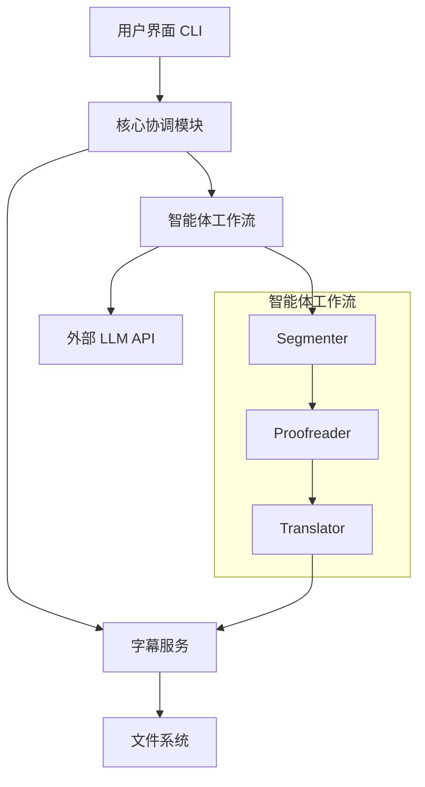
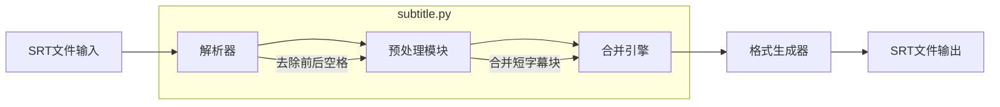

# Gnosis 项目架构设计

> 最后更新: 2025-06-02

## 系统概览

## 核心组件

### 1. 用户界面 (CLI)
- 负责参数解析、验证和进度显示
- **关键文件**: `cli.py`

### 2. 核心协调模块
- 流程控制与任务调度
- **关键文件**:
  - `gnosis/core/config.py` - 配置管理
  - `gnosis/core/logger.py` - 日志记录

### 3. 字幕服务
专注于SRT文件的基础处理：
- SRT文件加载与保存
- 字幕块解析与序列化
- 字幕内容分块处理
- 格式验证与标准化
- **关键文件**: 
  - `gnosis/services/subtitle/__init__.py`
  - `gnosis/services/subtitle/service.py`
  - `gnosis/services/subtitle/parser.py`

### 4. 智能体工作流
#### 4.1 Segmenter (断句修正)
- 修复断句问题
- 确保句子完整性和可读性
- 保持时间戳和格式不变
- **关键文件**: `gnosis/agents/segmenter.py`

#### 4.2 Proofreader (拼写检查)
- 修正拼写错误
- 修正重复词
- 修正常见ASR错误
- **关键文件**: `gnosis/agents/proofer.py`

#### 4.3 Translator (翻译)
- 将处理后的文本翻译成目标语言
- 保持格式和结构
- **关键文件**: `gnosis/agents/translator.py`

## 数据流

1. 用户通过CLI提供输入文件路径和参数
2. 核心协调模块初始化处理流程
3. **字幕服务执行：**
   - 加载SRT文件
   - 解析为结构化数据
   - 按需分块处理
4. **智能体处理管道：**
   - Segmenter: 修正断句问题
   - Proofreader: 修正拼写和语法错误
   - Translator: 执行翻译
5. **字幕服务执行：**
   - 重组处理后的内容
   - 格式化为标准SRT
   - 写入输出文件
6. 处理状态和结果反馈给用户

## 技术选择

- **Python 3.10+**: 主要开发语言
- **Agno**: 智能体框架核心
- **pydantic**: 数据验证和设置管理
- **tqdm**: 进度显示
- **asyncio**: 异步编程支持
- **aiofiles**: 异步文件操作
- **httpx**: 异步HTTP客户端

## 关键设计决策

### 字幕服务增强设计

### 智能体工作流设计
- **Segmenter**: 负责断句修正
- **Proofreader**: 负责拼写和语法修正
- **Translator**: 负责翻译
- 通过 Agno Workflow 编排执行顺序
- 支持错误处理和重试机制

## 扩展性考虑

1. **智能体扩展**：
   - 基于 Workflow 的工作流编排
   - 标准化的智能体接口
   - 可配置的处理步骤和条件分支

2. **性能优化**：
   - 支持并行处理独立字幕块
   - 可配置的批处理大小
   - 处理状态持久化

3. **格式支持**：
   - 插件式字幕解析器
   - 统一的字幕模型接口
   - 格式转换工具

## 性能优化

- 异步批处理字幕块
- 内存高效的字幕处理
- LLM API调用并发控制
- 大文件分块处理机制

## 安全设计

- API密钥安全存储（环境变量/密钥管理）
- 输入内容消毒处理
- 错误处理不泄露敏感信息
- 文件权限控制
